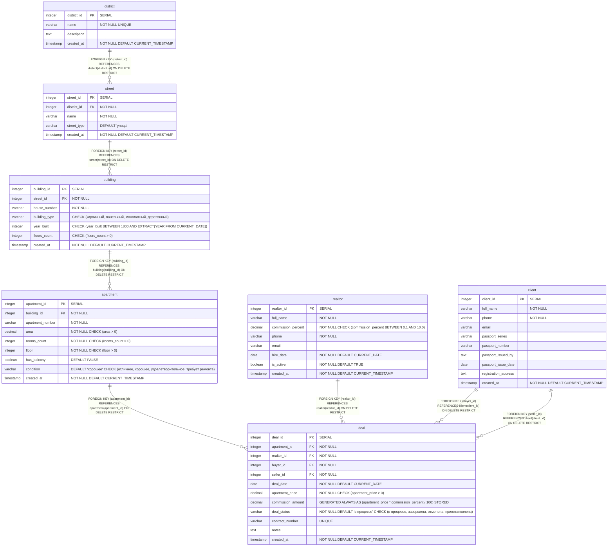

# databasekub
# Лабораторные работы по Базам Данных

Выполнил: Эрболот уулу Кубаныч(2261-ДБ)  
Telegram: @kub899

# Постановка задачи (вариант 24)

**Учет сделок с недвижимостью**

*Сущности:*
- Квартира (название улицы, номер дома, номер квартиры, площадь, количество комнат)
- Риелтор (ФИО, процент вознаграждения)
- Сделка (дата оформления сделки)

*Процессы:*
- Фирма занимается оформлением сделок с объектами жилой недвижимости

*Выходные документы:*
- Перечень сделок за определенный интервал дат, в котором указывается комиссионное вознаграждение риелтора за сделку. Оно вычисляется как Цена квартиры · Процент вознаграждения. Процент вознаграждения является индивидуальным и фиксированным для каждого риелтора. Перечень сортируется по риелторам
- Список квартир, упорядоченный по количеству комнат

# Лабораторная работа №1 (Проектирование логической и физической модели БД)

```text
Лаба по проектированию информационной модели для реляционных баз данных.
Предполагаем Postgresql. 

# Учет сделок с недвижимостью

## Постановка задачи

*Сущности:*
    Квартира (название улицы, номер дома, номер квартиры, площадь, количество комнат)
    Риелтор (ФИО, процент вознаграждения)
    Сделка (дата оформления сделки)

*Процессы:*
    Фирма занимается оформлением сделок с объектами жилой недвижимости

*Выходные документы:*

  - Перечень сделок за определенный интервал дат, в котором указывается комиссионное вознаграждение риелтора за сделку. Оно вычисляется как Цена квартиры · Процент вознаграждения. Процент вознаграждения является индивидуальным и фиксированным для каждого риелтора. Перечень сортируется по риелторам

  - Список квартир, упорядоченный по количеству комнат

## ER-Модель

### Базовые сущности

    Квартира(улица, номер_дома, номер_квартиры, площадь, количество_комнат)
    Риелтор(ФИО, процент_вознаграждения)
    Сделка(дата_оформления, цена_квартиры)

### Отношения

    [Риелтор]-1,Required------------------0..N,Optional-[Сделка]
    [Квартира]-1,Required------------------1..N,Required-[Сделка]

## Логическая модель

Получаем три таблицы:

  - ```Apartment(apartment_id, street, house_number, apartment_number, area, rooms_count)```, primary key - apartment_id
  - ```Realtor(realtor_id, full_name, commission_percent)```, primary key - realtor_id
  - ```Deal(deal_id, apartment_id, realtor_id, deal_date, apartment_price)```, primary key - deal_id

## Физическая модель

Зададим типы данных для атрибутов:

  - ```apartment_id::serial```
  - ```street::varchar(100)```
  - ```house_number::varchar(10)```
  - ```apartment_number::varchar(10)```
  - ```area::decimal(8,2)```
  - ```rooms_count::integer```
  - ```realtor_id::serial```
  - ```full_name::varchar(150)```
  - ```commission_percent::decimal(5,2)```
  - ```deal_id::serial```
  - ```apartment_id::integer```
  - ```realtor_id::integer```
  - ```deal_date::date```
  - ```apartment_price::decimal(12,2)```
```

## Ответ DeepSeek

Отличная основа для системы учета сделок с недвижимостью! Модель хорошо отражает бизнес-процессы, но есть несколько важных улучшений для создания более надежной и нормализованной базы данных.

### Критические замечания и рекомендации

### 1. Нормализация адресов
**Проблема:** Адресные данные хранятся непосредственно в таблице квартир, что приводит к избыточности данных.
**Исправление:** Создаем отдельные сущности для улиц, домов и районов для централизованного управления.

### 2. Улучшение структуры сделок
**Проблема:** Отсутствует информация о клиентах (покупателях/продавцах).
**Исправление:** Добавляем сущности для клиентов и связываем их со сделками.

### 3. Добавление проверок целостности
**Проблема:** Недостаточно ограничений для обеспечения бизнес-логики.
**Исправление:** Добавляем CHECK-ограничения для процентов, цен, площадей и дат.

### Исправленная и улучшенная модель

#### Логическая модель
*   **`District`** (`district_id`, name, description)
*   **`Street`** (`street_id`, district_id, name)
*   **`Building`** (`building_id`, street_id, house_number, building_type, year_built)
*   **`Apartment`** (`apartment_id`, building_id, apartment_number, area, rooms_count, floor)
*   **`Realtor`** (`realtor_id`, full_name, commission_percent, phone, email, hire_date)
*   **`Client`** (`client_id`, full_name, phone, email, passport_data)
*   **`Deal`** (`deal_id`, apartment_id, realtor_id, buyer_id, seller_id, deal_date, apartment_price, deal_status)

#### Физическая модель (DDL для PostgreSQL)
```sql
-- Таблица районов
CREATE TABLE district (
    district_id SERIAL PRIMARY KEY,
    name VARCHAR(100) NOT NULL UNIQUE,
    description TEXT,
    created_at TIMESTAMP NOT NULL DEFAULT CURRENT_TIMESTAMP
);

-- Таблица улиц
CREATE TABLE street (
    street_id SERIAL PRIMARY KEY,
    district_id INTEGER NOT NULL REFERENCES district(district_id) ON DELETE RESTRICT,
    name VARCHAR(100) NOT NULL,
    street_type VARCHAR(20) DEFAULT 'улица',
    created_at TIMESTAMP NOT NULL DEFAULT CURRENT_TIMESTAMP,
    UNIQUE(district_id, name)
);

-- Таблица домов
CREATE TABLE building (
    building_id SERIAL PRIMARY KEY,
    street_id INTEGER NOT NULL REFERENCES street(street_id) ON DELETE RESTRICT,
    house_number VARCHAR(10) NOT NULL,
    building_type VARCHAR(30) CHECK (building_type IN ('кирпичный', 'панельный', 'монолитный', 'деревянный')),
    year_built INTEGER CHECK (year_built BETWEEN 1800 AND EXTRACT(YEAR FROM CURRENT_DATE)),
    floors_count INTEGER CHECK (floors_count > 0),
    created_at TIMESTAMP NOT NULL DEFAULT CURRENT_TIMESTAMP,
    UNIQUE(street_id, house_number)
);

-- Таблица квартир
CREATE TABLE apartment (
    apartment_id SERIAL PRIMARY KEY,
    building_id INTEGER NOT NULL REFERENCES building(building_id) ON DELETE RESTRICT,
    apartment_number VARCHAR(10) NOT NULL,
    area DECIMAL(8,2) NOT NULL CHECK (area > 0),
    rooms_count INTEGER NOT NULL CHECK (rooms_count > 0),
    floor INTEGER NOT NULL CHECK (floor > 0),
    has_balcony BOOLEAN DEFAULT FALSE,
    condition VARCHAR(30) DEFAULT 'хорошее' CHECK (condition IN ('отличное', 'хорошее', 'удовлетворительное', 'требует ремонта')),
    created_at TIMESTAMP NOT NULL DEFAULT CURRENT_TIMESTAMP,
    UNIQUE(building_id, apartment_number),
    -- Проверка, что этаж не превышает количество этажей в доме
    FOREIGN KEY (building_id, floor) REFERENCES building(building_id, floors_count)
);

-- Таблица риелторов
CREATE TABLE realtor (
    realtor_id SERIAL PRIMARY KEY,
    full_name VARCHAR(150) NOT NULL,
    commission_percent DECIMAL(5,2) NOT NULL CHECK (commission_percent BETWEEN 0.1 AND 10.0),
    phone VARCHAR(20) NOT NULL,
    email VARCHAR(150),
    hire_date DATE NOT NULL DEFAULT CURRENT_DATE,
    is_active BOOLEAN NOT NULL DEFAULT TRUE,
    created_at TIMESTAMP NOT NULL DEFAULT CURRENT_TIMESTAMP
);

-- Таблица клиентов
CREATE TABLE client (
    client_id SERIAL PRIMARY KEY,
    full_name VARCHAR(150) NOT NULL,
    phone VARCHAR(20) NOT NULL,
    email VARCHAR(150),
    passport_series VARCHAR(4),
    passport_number VARCHAR(6),
    passport_issued_by TEXT,
    passport_issue_date DATE,
    registration_address TEXT,
    created_at TIMESTAMP NOT NULL DEFAULT CURRENT_TIMESTAMP,
    UNIQUE(passport_series, passport_number)
);

-- Таблица сделок
CREATE TABLE deal (
    deal_id SERIAL PRIMARY KEY,
    apartment_id INTEGER NOT NULL REFERENCES apartment(apartment_id) ON DELETE RESTRICT,
    realtor_id INTEGER NOT NULL REFERENCES realtor(realtor_id) ON DELETE RESTRICT,
    buyer_id INTEGER NOT NULL REFERENCES client(client_id) ON DELETE RESTRICT,
    seller_id INTEGER NOT NULL REFERENCES client(client_id) ON DELETE RESTRICT,
    deal_date DATE NOT NULL DEFAULT CURRENT_DATE,
    apartment_price DECIMAL(12,2) NOT NULL CHECK (apartment_price > 0),
    commission_amount DECIMAL(10,2) GENERATED ALWAYS AS (apartment_price * commission_percent / 100) STORED,
    deal_status VARCHAR(20) NOT NULL DEFAULT 'в процессе' CHECK (deal_status IN ('в процессе', 'завершена', 'отменена', 'приостановлена')),
    contract_number VARCHAR(50) UNIQUE,
    notes TEXT,
    created_at TIMESTAMP NOT NULL DEFAULT CURRENT_TIMESTAMP,
    -- Проверка, что покупатель и продавец - разные лица
    CHECK (buyer_id != seller_id),
    -- Проверка даты сделки (не в будущем)
    CHECK (deal_date <= CURRENT_DATE)
);

-- Индексы для оптимизации частых запросов
CREATE INDEX idx_apartment_building ON apartment(building_id);
CREATE INDEX idx_apartment_rooms ON apartment(rooms_count);
CREATE INDEX idx_apartment_area ON apartment(area);
CREATE INDEX idx_building_street ON building(street_id);
CREATE INDEX idx_street_district ON street(district_id);
CREATE INDEX idx_realtor_name ON realtor(full_name);
CREATE INDEX idx_realtor_active ON realtor(is_active);
CREATE INDEX idx_client_name ON client(full_name);
CREATE INDEX idx_client_phone ON client(phone);
CREATE INDEX idx_deal_date ON deal(deal_date);
CREATE INDEX idx_deal_realtor ON deal(realtor_id);
CREATE INDEX idx_deal_apartment ON deal(apartment_id);
CREATE INDEX idx_deal_buyer ON deal(buyer_id);
CREATE INDEX idx_deal_seller ON deal(seller_id);
CREATE INDEX idx_deal_status ON deal(deal_status);
```

#### Проверка нормальных форм
*   **1NF:** Соблюдена - все значения атомарные
*   **2NF:** Соблюдена - нет зависимостей неключевых атрибутов от части ключа
*   **3NF/BCNF:** Соблюдена - нет транзитивных зависимостей, все неключевые атрибуты зависят только от ключа

---

### Примеры запросов для "Выходных документов"

**1. Перечень сделок за определенный интервал дат с комиссионным вознаграждением:**
```sql
SELECT 
    r.realtor_id,
    r.full_name as риелтор,
    r.commission_percent as "процент_вознаграждения",
    d.deal_date as дата_сделки,
    CONCAT(s.name, ' ', s.street_type, ', д. ', b.house_number, ', кв. ', a.apartment_number) as адрес,
    a.area as площадь,
    a.rooms_count as комнаты,
    d.apartment_price as цена_квартиры,
    d.commission_amount as вознаграждение
FROM deal d
JOIN realtor r ON d.realtor_id = r.realtor_id
JOIN apartment a ON d.apartment_id = a.apartment_id
JOIN building b ON a.building_id = b.building_id
JOIN street s ON b.street_id = s.street_id
WHERE d.deal_date BETWEEN '2024-01-01' AND '2024-12-31'  -- Заменить на нужный интервал дат
    AND d.deal_status = 'завершена'
    AND r.is_active = TRUE
ORDER BY r.full_name, d.deal_date;
```

**2. Список квартир, упорядоченный по количеству комнат:**
```sql
SELECT 
    a.apartment_id,
    CONCAT(s.name, ' ', s.street_type, ', д. ', b.house_number, ', кв. ', a.apartment_number) as адрес,
    a.area as площадь,
    a.rooms_count as комнаты,
    a.floor as этаж,
    b.building_type as тип_дома,
    b.year_built as год_постройки,
    a.condition as состояние,
    CASE WHEN a.has_balcony THEN 'Есть' ELSE 'Нет' END as балкон
FROM apartment a
JOIN building b ON a.building_id = b.building_id
JOIN street s ON b.street_id = s.street_id
ORDER BY a.rooms_count, a.area DESC;
```

**Дополнительный полезный запрос - статистика по риелторам:**
```sql
SELECT 
    r.realtor_id,
    r.full_name as риелтор,
    COUNT(d.deal_id) as количество_сделок,
    SUM(d.apartment_price) as общий_объем_продаж,
    SUM(d.commission_amount) as общее_вознаграждение,
    ROUND(AVG(r.commission_percent)::numeric, 2) as средний_процент,
    MIN(d.deal_date) as первая_сделка,
    MAX(d.deal_date) as последняя_сделка
FROM realtor r
LEFT JOIN deal d ON r.realtor_id = d.realtor_id 
    AND d.deal_status = 'завершена'
    AND d.deal_date >= CURRENT_DATE - INTERVAL '1 year'
WHERE r.is_active = TRUE
GROUP BY r.realtor_id, r.full_name
ORDER BY общее_вознаграждение DESC;
```

## Полученные диаграммы:

### ER-диаграмма


## Логическая модель в виде Диаграммы классов UML


## Физическая модель БД



## Заключение

В лабораторной работе произведено проектирование ER-, логической и физической модели базы данных для учета сделок с недвижимостью (вариант 24). Основные улучшения, внесенные в ходе проектирования:

1. **Нормализация адресов** - созданы отдельные сущности "Районы", "Улицы" и "Дома" для устранения избыточности данных
2. **Учет клиентов** - добавлены сущности для покупателей и продавцов с паспортными данными
3. **Расширенная информация о недвижимости** - добавлены этажи, тип дома, год постройки, состояние квартиры
4. **Генерация вычисляемых полей** - комиссионное вознаграждение автоматически рассчитывается на основе цены и процента
5. **Расширенная валидация** - добавлены CHECK-ограничения для процентов, цен, площадей, дат и статусов
6. **Бизнес-логика** - реализованы проверки на уникальность адресов и паспортных данных
7. **Оптимизация производительности** - созданы индексы для частых запросов по датам, риелторам и количеству комнат
8. **Соблюдение нормальных форм** - модель соответствует требованиям 3NF/BCNF

Модель эффективно поддерживает все требуемые бизнес-процессы и выходные документы, обеспечивая надежное хранение данных, целостность отношений и высокую производительность запросов по сделкам и квартирам.
# Лабораторная работа №2 (Инсталляция БД на сервере)
## Создание DDL-запросов для PostgreSQL

### Создание схемы и таблиц


### Заполнил таблицу

### Проверяем
### Сами таблицы

### Данные в таблицах
### таблица  apartament

### таблица  client

### таблица  deal

### таблица  realtor


##запросы
### Список квартир по количеству комнат

### Перечень сделок с комиссионным вознаграждением

